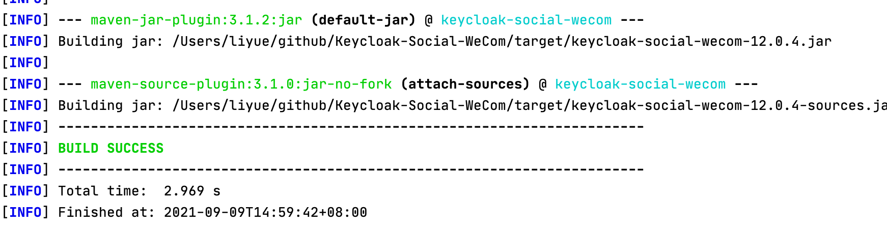
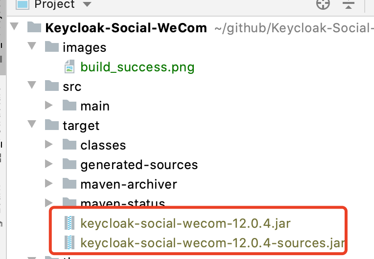
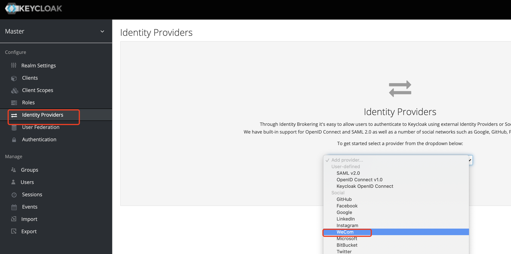
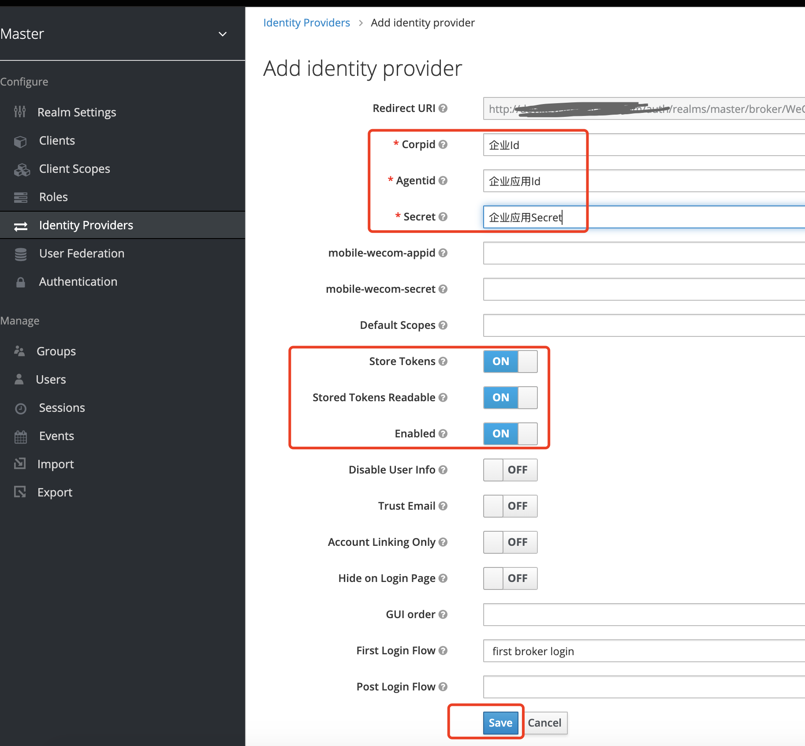

# keycloak-Social-WeCom
Keywords: Keycloak WeCom 企业微信

This is WeCom plugin for keycloak 12.0.4, in order to extend Keycloak Identity Social Provider

Also has Existing Docker Image, U can use directly

```shell
docker run -it --name keycloak-wecom -p 80:8080 -e KEYCLOAK_USER=admin -e KEYCLOAK_PASSWORD=admin qugeppl/keycloak-social-wecom:12.0.4.1
```

**To build**

~~~shell
mvn clean package
~~~

**The plugin jar will be found in ${PluginHome}/target when it build successfully**



To build Keycloak Official Docker Image with WeCom plugin,pls run
`docker build -t ${dockerns}/keycloak-social-wecom:${tag} .`
like 
`docker build -t qugeppl/keycloak-social-wecom:12.0.4.1 .`

Effect:
Browser view `http://localhost`

Create WeCom Provider:


Input WeCom Info:



